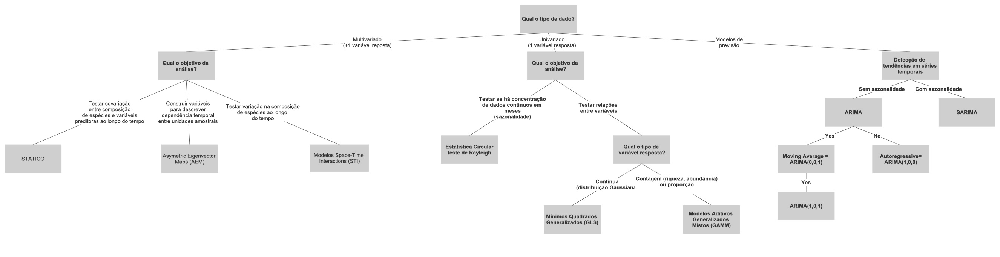
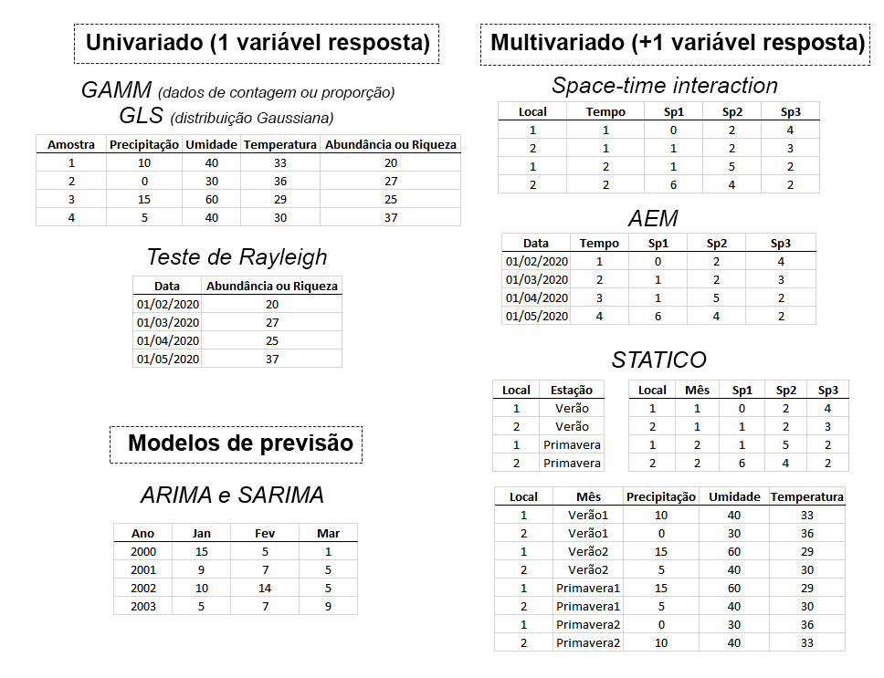

# Guia de análises

Neste tutorial fornecemos um R markdown para análises de séries temporais exemplificadas no artigo "Boas práticas na análise de séries temporais em herpetologia"
de Karoline Ceron, Marcos R. Severgnini & Diogo B. Provete.

Antes de ir ao tutorial, siga o passo-a-passo abaixo:

## Selecione a análise mais adequada ao seu conjunto de dados

## Prepare o formato de entrada dos dados

## Boa análise! 
